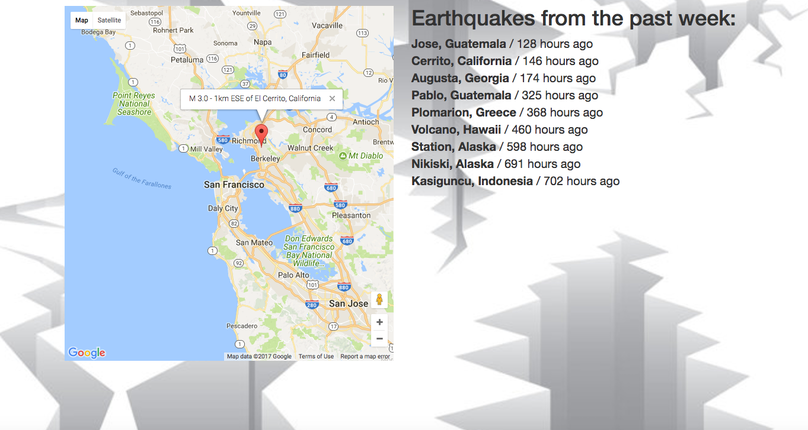

## GeoQuakes

#### I used live data from the USGS (United States Geological Survey), showing earthquakes from the past week. Used a template string to display data from an AJAX call on HTML page.

## Technologies:

* HTML
* CSS
* jQuery
* AJAX (to grab data from the USGS earthquakes API)
* Google Maps API to embed a map
